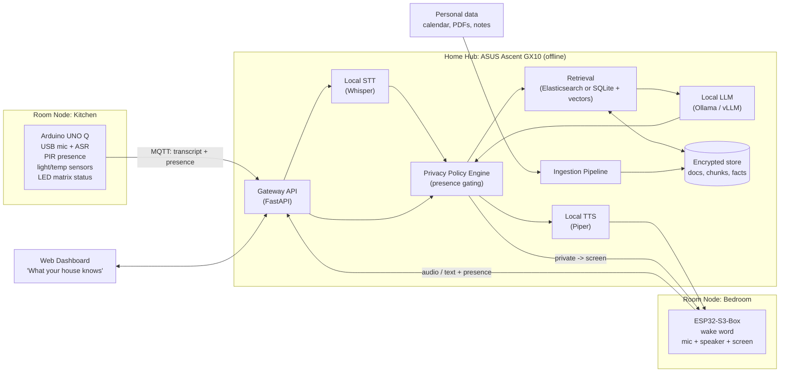

# hackmit2026 — Build Plan

> **One-liner:** A secure AI assistant that lives in your home. Your personal data never leaves the house, and the house only tells the right person.

Working name: **Hearth** (placeholder — rename freely)

**Deadline:** Sunday 11:00 AM (submission). **Feature freeze:** Sunday 9:00 AM.

---

## Table of Contents

1. [Product Vision](#1-product-vision)
2. [What Makes This Different](#2-what-makes-this-different)
3. [Threat Model](#3-threat-model)
4. [System Architecture](#4-system-architecture)
5. [Component Specs](#5-component-specs)
6. [Data Model](#6-data-model)
7. [Interfaces and Message Contracts](#7-interfaces-and-message-contracts)
8. [Hardware List](#8-hardware-list)
9. [Sponsor Tracks](#9-sponsor-tracks)
10. [Team Roles](#10-team-roles)
11. [Timeline](#11-timeline)
12. [Demo Script](#12-demo-script)
13. [Risks and Fallbacks](#13-risks-and-fallbacks)
14. [Scope: Must / Should / Stretch](#14-scope-must--should--stretch)
15. [Judge Q&A Prep](#15-judge-qa-prep)
16. [Submission Checklist](#16-submission-checklist)

---

## 1. Product Vision

People already hand their calendars, documents, bills, and messages to cloud AI assistants, or they refuse to use AI at all because they don't trust where that data goes. Hearth is a third option: a personal AI assistant that runs on a computer inside your home.

- **Your data stays home.** Documents, calendar, notes, and voice memos are indexed and stored on a local machine (ASUS Ascent GX10). The LLM runs locally. No cloud API calls.
- **You talk to it from anywhere in the house.** Room nodes (Arduino UNO Q, ESP32-S3-Box) with microphones, speakers, and sensors are the interface.
- **It knows who's listening.** Presence sensing in each room decides whether it's safe to say private information aloud.

**Target user:** the privacy-conscious skeptic who would use an AI assistant if they could trust it with their data.

---

## 2. What Makes This Different

Judges will ask: *"Why not just run Ollama with RAG on a laptop?"* Our answer is the **home**, not just "it's local."

| Feature | Laptop + Ollama | Cloud assistant | Hearth |
|---|---|---|---|
| Data stays local | Yes | No | Yes |
| Works with internet unplugged | Yes | No | Yes |
| Accessible by voice from every room | No | Partly | Yes |
| Knows who else is in the room | No | No | **Yes** |
| Withholds private answers when others are present | No | No | **Yes** |
| Visible, deletable memory | Varies | Partly | **Yes** |

The core differentiator is **presence-aware privacy gating**: the physical world decides what the AI is allowed to say.

---

## 3. Threat Model

State this in one sentence during the demo:

> **Your data never leaves the house, and the house only tells the right person.**

| Threat | Mitigation | Priority |
|---|---|---|
| Personal data sent to a third-party AI provider | All inference local on GX10; no outbound API calls | Must |
| Data exfiltration over the internet | Isolated LAN on our own router; hub firewall blocks outbound traffic | Must |
| Guest or roommate overhears private info | Presence sensor gates spoken responses; private answers go to screen instead | Must |
| Raw audio stored or leaked | Speech transcribed at the edge or immediately on hub; raw audio never stored | Must |
| Data at rest stolen (disk pulled) | Encrypted data store | Should |
| Someone else asks for your data by voice | Speaker verification / enrolled voice profile | Stretch |
| User can't see or control what's stored | Dashboard to browse and delete every document and fact | Must |

**Out of scope for the hackathon:** physical attacks on the hub, compromised router firmware, side channels. Say so honestly if asked.

---

## 4. System Architecture



**Network:** All devices on an isolated LAN from our own travel router. The hub has no route to the internet during the demo.

### Request lifecycle

1. User speaks at a room node ("Hey Hearth, what do I owe this month?").
2. Node produces text (on-device ASR on UNO Q, or audio to hub Whisper for ESP32) and attaches current room presence state.
3. Gateway sends query to retrieval, which returns relevant chunks and facts with sources.
4. LLM generates an answer with citations and a **sensitivity label** (`public` / `private`).
5. Policy engine checks: if `private` and presence count > 1 (or unknown speaker), the answer is **withheld from speech** and shown on the node's screen or dashboard instead.
6. TTS speaks the allowed response on the node.

---

## 5. Component Specs

### 5.1 Home Hub (ASUS Ascent GX10)

- **OS:** Ubuntu-based NVIDIA DGX OS (preinstalled).
- **LLM serving:** Ollama (fastest to set up) or vLLM (faster inference). Pick a mid-size instruct model; **latency matters more than size** for voice. Target under 3 s to first spoken word.
- **Embeddings:** local embedding model served alongside the LLM.
- **Retrieval:** Elasticsearch (self-hosted, hybrid BM25 + vector) if pursuing the Elastic track; otherwise SQLite + a vector extension.
- **STT:** faster-whisper for audio coming from ESP32 nodes.
- **TTS:** Piper.
- **API:** FastAPI gateway; MQTT broker (Mosquitto) for node messages.
- **Storage:** encrypted volume or application-level encryption for the store.

### 5.2 Ingestion Pipeline

Input sources for the demo persona:

- Calendar export (`.ics`)
- PDFs: lease, medical bill, class syllabus, a pay stub or receipt
- Notes / to-do list (`.md` / `.txt`)
- Voice memos created through the assistant ("remember that I lent Sam $40")

Steps:

1. Parse (PDF text extraction, ICS parsing).
2. Chunk (~500 tokens, overlap ~50).
3. Embed and index chunks.
4. LLM extracts structured **facts** (amounts, dates, people, commitments) with a link back to the source chunk.
5. Each document and fact gets a **sensitivity label** (financial, medical, and personal contacts default to `private`).

### 5.3 Room Node A — Arduino UNO Q

- **Linux side (Qualcomm MPU):** App Lab Python app; speech-to-text via the App Lab ASR Brick (fallback: send audio to hub Whisper); publishes to MQTT.
- **MCU side (STM32):** reads PIR motion sensor, light sensor, temperature sensor; drives LED matrix.
- **LED matrix states:** idle, listening, thinking, "private mode" (others present), muted.
- **Physical mute button:** disables mic, shown on LED matrix.

### 5.4 Room Node B — ESP32-S3-Box

- Wake word (ESP-SR).
- Streams audio (or pushes text) to hub over Wi-Fi.
- Plays TTS responses on built-in speaker.
- Built-in screen shows private answers when speech is withheld.
- Presence: add a PIR sensor via headers, or treat presence from the nearest UNO Q node.

### 5.5 Privacy Policy Engine

Simple rules first; do not over-engineer.

```
if answer.sensitivity == "private":
    if room.presence_count > 1 or room.presence_unknown:
        -> speak: "Someone else is here. I've put that on your screen."
        -> send full answer to node screen / dashboard
    else:
        -> speak full answer
else:
    -> speak full answer
```

Presence count heuristic for the hackathon: one PIR + a second trigger source (second PIR, door sensor, or ultrasonic distance) to estimate "more than one person." Be honest in the pitch that this is a prototype heuristic.

### 5.6 Web Dashboard

- List all ingested documents with sensitivity labels.
- List extracted facts with source links.
- Delete button for documents and facts (deletes chunks, embeddings, and facts).
- Live panel: room presence, node status, network status ("Internet: OFF").
- Query log showing which answers were withheld and why.

---

## 6. Data Model

```
documents
  id, title, source_type (pdf|ics|note|voice_memo), sensitivity,
  created_at, file_hash

chunks
  id, document_id, text, embedding, position

facts
  id, document_id, chunk_id, subject, predicate, object,
  value_date, value_amount, sensitivity, created_at

rooms
  id, name, node_id, presence_count, last_motion_at

query_log
  id, room_id, query_text, answer_text, sensitivity,
  action (spoken|withheld_to_screen), sources[], created_at
```

**Deletion rule:** deleting a document cascades to its chunks, embeddings, and facts. This is part of the demo, so test it.

---

## 7. Interfaces and Message Contracts

### MQTT topics

| Topic | Direction | Payload |
|---|---|---|
| `home/{room}/presence` | node → hub | `{"count": 2, "motion": true, "ts": ...}` |
| `home/{room}/sensors` | node → hub | `{"temp_c": 22.1, "lux": 310, "ts": ...}` |
| `home/{room}/query` | node → hub | `{"text": "...", "node_id": "...", "ts": ...}` |
| `home/{room}/response` | hub → node | `{"speak": "...", "screen": "...", "state": "private"}` |
| `home/{room}/status` | hub → node | `{"led": "listening"}` |

### HTTP API (gateway)

| Method | Path | Purpose |
|---|---|---|
| `POST` | `/ingest` | Upload a document |
| `POST` | `/query` | Text query (for testing without hardware) |
| `POST` | `/audio` | Audio query from ESP32 |
| `GET` | `/documents` | List documents |
| `DELETE` | `/documents/{id}` | Delete document and derived data |
| `GET` | `/facts` | List facts |
| `DELETE` | `/facts/{id}` | Delete a fact |
| `GET` | `/status` | Nodes, presence, network state |

**Rule:** `/query` over HTTP must work end to end before any hardware is integrated. Everyone can test against it.

---

## 8. Hardware List

- [ ] ASUS Ascent GX10 (**check out immediately**, first come first served)
- [ ] Arduino UNO Q
- [ ] ESP32-S3-Box (x1–2, from Espressif)
- [ ] USB microphone for UNO Q
- [ ] USB-C hub with power delivery (UNO Q peripherals)
- [ ] PIR motion sensors (x2+)
- [ ] Light sensor, temperature sensor
- [ ] Push button (mute)
- [ ] Jumper wires, breadboard
- [ ] Travel router or dedicated hotspot (isolated LAN)
- [ ] Ethernet cable (for the on-stage "unplug" moment)
- [ ] Monitor or laptop for dashboard
- [ ] Power strip

**Fallback if no GX10:** a laptop running Ollama with a smaller model. The architecture doesn't change.

---

## 9. Sponsor Tracks

Only enter tracks the product genuinely fits. Don't bend the product for a track.

| Track | Fit | What we show |
|---|---|---|
| **ASUS — Build What's Next** | Primary | GX10 as the home AI hub running LLM, embeddings, STT, TTS, retrieval fully offline |
| **Arduino — Touch Grass** | Primary | UNO Q sensing presence and environment; physical world decides what the AI may say |
| **Espressif — AIoT** | Strong | ESP32-S3-Box as a voice room node with wake word, speaker, and screen |
| **Long Lake — Convince a Non-Believer** | Strong | Pitch to the AI skeptic who distrusts cloud AI with personal data |
| **Dropbox — Digital chaos to useful** | Strong | Messy personal files (bills, lease, calendar) become answers and actions |
| **Elastic — Find the Signal** | Good | Local Elasticsearch hybrid search over personal documents |
| **The Token Company — LLM cost saving** | Good | $0 per-token local inference; context compression; report measured token savings |
| **Ramp — Save time, save money** | Okay | "What do I owe this month?" surfaces bills and deadlines |

**Avoid:** Deepgram, ElevenLabs, OpenAI, SpaceXAI, Runpod. They require cloud APIs, which contradicts the core claim.

---

## 10. Team Roles

Adjust to team size. Every role owns a demo step.

| Role | Owns | Demo step |
|---|---|---|
| **Hub / AI** | LLM serving, retrieval, ingestion, fact extraction | Correct answers with citations |
| **Hardware A** | UNO Q: ASR, sensors, LED matrix, MQTT | Presence-triggered privacy |
| **Hardware B** | ESP32-S3-Box: wake word, audio, TTS playback, screen | Voice from second room |
| **Product / Frontend** | Dashboard, policy engine, demo persona data, pitch | Delete and forget; overall story |

With 3 people: Hardware A takes the ESP32 as a stretch goal. With 2 people: skip the ESP32 entirely.

---

## 11. Timeline

Assumes start ~2:00 PM Saturday. Shift blocks if needed; **keep the checkpoints**.

### Saturday

| Time | Goal | Details |
|---|---|---|
| **2:00–3:00 PM** | Lock down | Check out GX10 + ESP32 boxes. Finalize demo script. Assign roles. Create repo structure. Set up router/LAN. |
| **3:00–7:00 PM** | Parallel build | **Hub:** model running, `/query` + `/ingest` working with text. **HW A:** UNO Q ASR + PIR + MQTT publish. **HW B:** ESP32 wake word + audio to hub. **Product:** build demo persona dataset, dashboard skeleton. |
| **7:00–8:00 PM** | **Checkpoint 1** | One ugly end-to-end path: speak at UNO Q → transcript → retrieval → answer spoken back. If broken, everyone helps fix it. |
| **8:00 PM–1:00 AM** | Make it smart and private | Fact extraction, sensitivity labels, citations. **Presence gating policy engine (must-have).** LED matrix states. Elasticsearch if pursuing Elastic. |

### Sunday

| Time | Goal | Details |
|---|---|---|
| **1:00–2:00 AM** | **Checkpoint 2** | Full demo run start to finish. **Cut anything not working.** |
| **2:00–6:00 AM** | Trust features and polish | Delete cascade, network-off status, mute button, second room node, dashboard polish, token savings metrics. Sleep in shifts (2 people awake at all times). |
| **6:00–9:00 AM** | Harden | Bug bash. Rehearse demo 10+ times. **Record backup demo video.** Write Devpost + per-track paragraphs. README + architecture diagram. |
| **9:00 AM** | **Feature freeze** | No new features. Bug fixes only. |
| **9:00–11:00 AM** | Submit | Submit early (by 10:15). Buffer for surprises. |

---

## 12. Demo Script

Target: 90 seconds, then Q&A. Persona: "Alex," a student with rent, a medical bill, classes, and friends.

1. **Setup (10 s):** "Everyone wants an AI that knows their life. Nobody wants to give their life to a cloud company. Hearth lives in your house."
2. **Knows your life (20 s):** Alone at the kitchen node: *"What do I owe this month?"* It answers with rent and the medical bill amount, and cites the lease and bill.
3. **Knows who's listening (20 s):** A teammate walks into view; the LED matrix switches to private mode. Ask again. *"Someone else is here. I've put that on your screen."* The ESP32 screen shows the answer.
4. **Nothing leaves the house (15 s):** Unplug the Ethernet on stage. Dashboard shows "Internet: OFF." Ask a new question at the bedroom node. It still works.
5. **You control what it knows (15 s):** Delete the medical bill in the dashboard. Ask about it again; the assistant no longer knows.
6. **Close (10 s):** "Your data never leaves the house, and the house only tells the right person."

---

## 13. Risks and Fallbacks

| Risk | Likelihood | Fallback |
|---|---|---|
| No GX10 available | Medium | Laptop + Ollama with smaller model |
| UNO Q ASR Brick flaky (new feature) | Medium | Send audio to hub Whisper instead |
| Venue Wi-Fi congestion | High | Our own router; everything local anyway |
| Loud hall ruins speech recognition | High | Close-talk mic; push-to-talk button; typed query fallback on dashboard |
| LLM too slow for voice | Medium | Smaller model, shorter context, stream TTS sentence-by-sentence |
| Presence detection unreliable | Medium | Manual "guest present" toggle on dashboard for demo; be honest about it |
| Hardware fails during judging | Medium | Backup demo video recorded by 8 AM |
| Team exhaustion | High | Sleep shifts; feature freeze at 9 AM is non-negotiable |

**Test in the first two hours:** GX10 model latency, UNO Q ASR, mic quality in the hall.

---

## 14. Scope: Must / Should / Stretch

### Must (the demo fails without these)

- [ ] Local LLM answering questions over ingested personal documents with citations
- [ ] Voice query from at least one room node (UNO Q)
- [ ] Presence-aware privacy gating (withhold private answers when others present)
- [ ] Works with internet unplugged
- [ ] Dashboard listing documents with delete that actually removes knowledge

### Should

- [ ] Second room node (ESP32-S3-Box) with screen for private answers
- [ ] LED matrix status states and mute button
- [ ] Structured fact extraction
- [ ] Elasticsearch retrieval
- [ ] Voice memos ("remember that...")
- [ ] Token savings metrics

### Stretch

- [ ] Speaker verification (only enrolled user gets private answers)
- [ ] Encryption at rest
- [ ] Proactive reminders ("rent is due in 3 days") triggered when you enter a room
- [ ] Environmental context in answers (temperature, time of day)

---

## 15. Judge Q&A Prep

**"Isn't an always-listening device creepy?"**
It only responds after a wake word, raw audio is never stored, there's a physical mute with a visible indicator, and it won't speak private data when others are present.

**"Why not just use Ollama on a laptop?"**
A laptop doesn't know who's in the room. Hearth is a home system: voice from every room, and physical presence decides what it's allowed to say.

**"How accurate is presence detection?"**
It's a prototype heuristic with PIR sensors. A production version would use mmWave radar or camera-free occupancy sensing. The policy engine is the contribution; sensors are swappable.

**"A GX10 is expensive. Who buys this?"**
The GX10 shows the ceiling. The architecture runs on cheaper hardware with smaller models, and the cost trend in local AI hardware is steeply downward.

**"What model are you running and how fast?"**
Have the exact model name, size, and measured latency ready. Put them on a slide.

**"What stops someone from just asking in your voice?"**
Speaker verification is on our roadmap (or: here's our prototype). Be honest about what's built.

---

## 16. Submission Checklist

- [ ] Devpost submitted by 10:15 AM
- [ ] Public GitHub repo with README, this plan, architecture diagram, setup instructions
- [ ] Demo video (2–3 min), including backup hardware footage
- [ ] Per-track paragraphs in Devpost (ASUS, Arduino, Espressif, Long Lake, Dropbox, Elastic, Token Company, Ramp)
- [ ] Hardware checked back in to sponsors
- [ ] Measured metrics: latency, token savings, number of documents/facts indexed
- [ ] Team names and contacts on Devpost

---

## Suggested Repo Structure

```
hackmit2026/
├── README.md
├── PLAN.md
├── hub/
│   ├── gateway/          # FastAPI app, MQTT handlers
│   ├── ingest/           # parsers, chunking, fact extraction
│   ├── retrieval/        # Elasticsearch / vector search
│   ├── policy/           # privacy gating engine
│   └── voice/            # Whisper STT, Piper TTS
├── nodes/
│   ├── uno-q/            # App Lab app + STM32 sketch
│   └── esp32-box/        # ESP-IDF firmware
├── dashboard/            # web UI
├── demo-data/            # fake persona: PDFs, .ics, notes
└── docs/
    └── architecture.md
```
